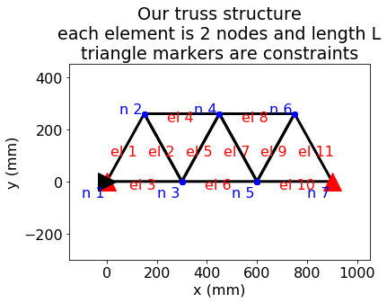
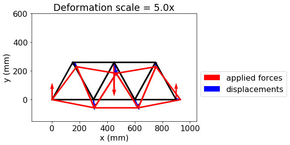

---
jupytext:
  formats: notebooks//ipynb,md:myst
  text_representation:
    extension: .md
    format_name: myst
    format_version: 0.13
    jupytext_version: 1.10.3
kernelspec:
  display_name: Python 3
  language: python
  name: python3
---

# CompMech04-Linear Algebra Project
# Practical Linear Algebra for Finite Element Analysis


+++

In this project we will perform a linear-elastic finite element analysis (FEA) on a support structure made of 11 beams that are riveted in 7 locations to create a truss as shown in the image below. 




+++

The triangular truss shown above can be modeled using a [direct stiffness method [1]](https://en.wikipedia.org/wiki/Direct_stiffness_method), that is detailed in the [extra-FEA_material](./extra-FEA_material.ipynb) notebook. The end result of converting this structure to a FE model. Is that each joint, labeled $n~1-7$, short for _node 1-7_ can move in the x- and y-directions, but causes a force modeled with Hooke's law. Each beam labeled $el~1-11$, short for _element 1-11_, contributes to the stiffness of the structure. We have 14 equations where the sum of the components of forces = 0, represented by the equation

$\mathbf{F-Ku}=\mathbf{0}$

Where, $\mathbf{F}$ are externally applied forces, $\mathbf{u}$ are x- and y- displacements of nodes, and $\mathbf{K}$ is the stiffness matrix given in `fea_arrays.npz` as `K`, shown below

_note: the array shown is 1000x(`K`). You can use units of MPa (N/mm^2), N, and mm. The array `K` is in 1/mm_

$\mathbf{K}=EA*$

$  \left[ \begin{array}{cccccccccccccc}
 4.2 & 1.4 & -0.8 & -1.4 & -3.3 & 0.0 & 0.0 & 0.0 & 0.0 & 0.0 & 0.0 & 0.0 & 0.0 & 0.0 \\
 1.4 & 2.5 & -1.4 & -2.5 & 0.0 & 0.0 & 0.0 & 0.0 & 0.0 & 0.0 & 0.0 & 0.0 & 0.0 & 0.0 \\
 -0.8 & -1.4 & 5.0 & 0.0 & -0.8 & 1.4 & -3.3 & 0.0 & 0.0 & 0.0 & 0.0 & 0.0 & 0.0 & 0.0 \\
 -1.4 & -2.5 & 0.0 & 5.0 & 1.4 & -2.5 & 0.0 & 0.0 & 0.0 & 0.0 & 0.0 & 0.0 & 0.0 & 0.0 \\
 -3.3 & 0.0 & -0.8 & 1.4 & 8.3 & 0.0 & -0.8 & -1.4 & -3.3 & 0.0 & 0.0 & 0.0 & 0.0 & 0.0 \\
 0.0 & 0.0 & 1.4 & -2.5 & 0.0 & 5.0 & -1.4 & -2.5 & 0.0 & 0.0 & 0.0 & 0.0 & 0.0 & 0.0 \\
 0.0 & 0.0 & -3.3 & 0.0 & -0.8 & -1.4 & 8.3 & 0.0 & -0.8 & 1.4 & -3.3 & 0.0 & 0.0 & 0.0 \\
 0.0 & 0.0 & 0.0 & 0.0 & -1.4 & -2.5 & 0.0 & 5.0 & 1.4 & -2.5 & 0.0 & 0.0 & 0.0 & 0.0 \\
 0.0 & 0.0 & 0.0 & 0.0 & -3.3 & 0.0 & -0.8 & 1.4 & 8.3 & 0.0 & -0.8 & -1.4 & -3.3 & 0.0 \\
 0.0 & 0.0 & 0.0 & 0.0 & 0.0 & 0.0 & 1.4 & -2.5 & 0.0 & 5.0 & -1.4 & -2.5 & 0.0 & 0.0 \\
 0.0 & 0.0 & 0.0 & 0.0 & 0.0 & 0.0 & -3.3 & 0.0 & -0.8 & -1.4 & 5.0 & 0.0 & -0.8 & 1.4 \\
 0.0 & 0.0 & 0.0 & 0.0 & 0.0 & 0.0 & 0.0 & 0.0 & -1.4 & -2.5 & 0.0 & 5.0 & 1.4 & -2.5 \\
 0.0 & 0.0 & 0.0 & 0.0 & 0.0 & 0.0 & 0.0 & 0.0 & -3.3 & 0.0 & -0.8 & 1.4 & 4.2 & -1.4 \\
 0.0 & 0.0 & 0.0 & 0.0 & 0.0 & 0.0 & 0.0 & 0.0 & 0.0 & 0.0 & 1.4 & -2.5 & -1.4 & 2.5 \\
\end{array}\right]~\frac{1}{m}$

```{code-cell} ipython3
import numpy as np
fea_arrays = np.load('./fea_arrays.npz')
K=fea_arrays['K']
K
```

In this project we are solving the problem, $\mathbf{F}=\mathbf{Ku}$, where $\mathbf{F}$ is measured in Newtons, $\mathbf{K}$ `=E*A*K` is the stiffness in N/mm, `E` is Young's modulus measured in MPa (N/mm^2), and `A` is the cross-sectional area of the beam measured in mm^2. 

There are three constraints on the motion of the joints:

i. node 1 displacement in the x-direction is 0 = `u[0]`

ii. node 1 displacement in the y-direction is 0 = `u[1]`

iii. node 7 displacement in the y-direction is 0 = `u[13]`

We can satisfy these constraints by leaving out the first, second, and last rows and columns from our linear algebra description. 

+++

### 1. Calculate the condition of `K` and the condition of `K[2:13,2:13]`. 

a. What error would you expect when you solve for `u` in `K*u = F`? 

b. Why is the condition of `K` so large? __The problem is underconstrained. It describes stiffness of structure, but not the BC's. So, we end up with sumF=0 and -sumF=0__

c. What error would you expect when you solve for `u[2:13]` in `K[2:13,2:13]*u=F[2:13]`

```{code-cell} ipython3
print(np.linalg.cond(K))
print(np.linalg.cond(K[2:13,2:13]))

print('expected error in x=solve(K,b) is {}'.format(10**(16-16)))
print('expected error in x=solve(K[2:13,2:13],b) is {}'.format(10**(2-16)))
```

### 2. Apply a 100-N downward force to the central top node (n 4)

a. Create the LU matrix for K[2:13,2:13]

b. Use cross-sectional area of $0.1~mm^2$ and steel and almuminum moduli, $E=200~GPa~and~E=70~GPa,$ respectively. Solve the forward and backward substitution methods for 

* $\mathbf{Ly}=\mathbf{F}\frac{1}{EA}$

* $\mathbf{Uu}=\mathbf{y}$

_your array `F` is zeros, except for `F[5]=-100`, to create a -100 N load at node 4._

c. Plug in the values for $\mathbf{u}$ into the full equation, $\mathbf{Ku}=\mathbf{F}$, to solve for the reaction forces

d. Create a plot of the undeformed and deformed structure with the displacements and forces plotted as vectors (via `quiver`). Your result for aluminum should match the following result from [extra-FEA_material](./extra-FEA_material.ipynb). _note: The scale factor is applied to displacements $\mathbf{u}$, not forces._



```{code-cell} ipython3
E=200e3
A=0.1
Ff=np.zeros(11)
Ff[5]=-100
print(Ff)
# step 1 solve for uf (the joints without constraints)
uf = np.linalg.solve(E*A*K[2:13,2:13],Ff)
u=np.zeros(14)
u[2:13]=uf

# step 2 solve for F (the solution should include reactions and applied forces)
F=E*A*K@u
print(F[2:13])
```

```{code-cell} ipython3
xy={0:'x',1:'y'}
print('displacements:\n----------------')
for i in range(len(u)):
    print('u_{}{}:{:.2f} mm'.format(int(i/2)+1,xy[i%2],u[i]))
print('\nforces:\n----------------')
for i in range(len(F)):
    print('F_{}{}:{:.2f} N'.format(int(i/2)+1,xy[i%2],F[i]))
```

```{code-cell} ipython3
import matplotlib.pyplot as plt
```

```{code-cell} ipython3
ix = 2*np.block([[np.arange(0,5)],[np.arange(1,6)],[np.arange(2,7)],[np.arange(0,5)]])
iy = ix+1
nodes = np.array([[1,0,0],[2,0.5,3**0.5/2],[3,1,0],[4,1.5,3**0.5/2],[5,2,0],[6,2.5,3**0.5/2],[7,3,0]])
nodes[:,1:3]*=300
elems = np.array([[1,1,2],[2,2,3],[3,1,3],[4,2,4],[5,3,4],[6,3,5],[7,4,5],[8,4,6],[9,5,6],[10,5,7],[11,6,7]])
r = np.block([n[1:3] for n in nodes])

s=5
l=300
plt.plot(r[ix],r[iy],'-',color=(0,0,0,1))
plt.plot(r[ix]+u[ix]*s,r[iy]+u[iy]*s,'-',color=(1,0,0,1))
#plt.quiver(r[ix],r[iy],u[ix],u[iy],color=(0,0,1,1),label='displacements')
plt.quiver(r[ix],r[iy],F[ix],F[iy],color=(1,0,0,1),label='applied forces')
plt.quiver(r[ix],r[iy],u[ix],u[iy],color=(0,0,1,1),label='displacements')
plt.axis(l*np.array([-0.5,3.5,-0.5,2]))
plt.xlabel('x (mm)')
plt.ylabel('y (mm)')
plt.title('Deformation scale = {:.1f}x'.format(s))
plt.legend(bbox_to_anchor=(1,0.5))
```

### 3. Determine cross-sectional area

a. Using aluminum, what is the minimum cross-sectional area to keep total y-deflections $<0.2~mm$?

b. Using steel, what is the minimum cross-sectional area to keep total y-deflections $<0.2~mm$?

c. What are the weights of the aluminum and steel trusses with the chosed cross-sectional areas?

d. The current price (2020/03) of [aluminum](https://tradingeconomics.com/commodity/aluminum) is 1545 dollars/Tonne and [steel](https://tradingeconomics.com/commodity/steel) is 476 dollars/Tonne [2]. Which material is cheaper to  create the truss?

```{code-cell} ipython3
rhoSteel = 8000/1000**3 #kg/m^3*1m^3/(1000**3mm**3) [kg/mm^3]
rhoAl = 2700/1000**3 #kg/m^3*1m^3/(1000**3mm**3) [kg/mm^3]
```

__Solve the problem with given E for Steel and Aluminum (I used 200 GPa and 70 GPa, respectively). Then, total price is the volume x density x price/tonne/1000, here I used 8000 and 2700 kg/m^3, respectively.__

Its a linear solution, so once you have one answer e.g. max deflection is 10 mm, you can multiply the Area by the actual/desired

```{code-cell} ipython3
E=200e3
A=0.1
Ff=np.zeros(11)
Ff[5]=-100
print(Ff)
# step 1 solve for uf (the joints without constraints)
uf = np.linalg.solve(E*A*K[2:13,2:13],Ff)
u=np.zeros(14)
u[2:13]=uf


np.abs(u).max()/0.2
```

with A=0.1, its 27x off, so multiply area be 27. 

```{code-cell} ipython3
E=200e3
A=0.1*26.875 # new cross-section
Ff=np.zeros(11)
Ff[5]=-100

# step 1 solve for uf (the joints without constraints)
uf = np.linalg.solve(E*A*K[2:13,2:13],Ff)
u=np.zeros(14)
u[2:13]=uf


print('(max deflection)/(0.2mm)=',np.abs(u).max()/0.2)
print('A=',A,'mm^2')
print('total volume =',A*300*7,'mm^3')
print('total price =${:.04f}/truss'.format(A*300*7*rhoSteel*476e-3))
```

```{code-cell} ipython3
E=70e3
A=0.1 # new cross-section
Ff=np.zeros(11)
Ff[5]=-100
# step 1 solve for uf (the joints without constraints)
uf = np.linalg.solve(E*A*K[2:13,2:13],Ff)
u=np.zeros(14)
u[2:13]=uf

print(np.abs(u).max()/0.2)
```

with A=0.1, its 77x off, so multiply area by 77. 

```{code-cell} ipython3
E=70e3
A=0.1*76.7857 # new cross-section
Ff=np.zeros(11)
Ff[5]=-100
# step 1 solve for uf (the joints without constraints)
uf = np.linalg.solve(E*A*K[2:13,2:13],Ff)
u=np.zeros(14)
u[2:13]=uf


print('(max deflection)/(0.2mm)=',np.abs(u).max()/0.2)
print('A=',A,'mm^2')
print('total volume =',A*300*7,'mm^3')
print('total price =${:.4f}/truss'.format(A*300*7*rhoAl*476e-3))
```

__Choose Aluminum based upon current prices and total volume needed.__ (this is subject to variation in the choice of density and modulus)

+++

### 4. Future Predictions using past data

The data from the price of aluminum and steel are in the data files `../data/al_prices.csv` and `../data/steel_price.csv`. If you're going to produce these supports for 5 years, how would you use the price history of steel and aluminum to compare how much manufacturing will cost?

a. Separate the aluminum and steel data points into training and testing data (70-30%-split)

b. Fit the training data to polynomial functions of order n. _Choose the highest order._

c. Plot the error between your model and the training data and the error between your model and you testing data as a function of the polynomial function order, n. [Create the training-testing curves](../notebooks/03_Linear-regression-algebra.ipynb)

d. Choose a polynomial function to predict the price of aluminum and steel in the year 2025. 

e. Based upon your price model would you change your answer in __3.b__?

```{code-cell} ipython3
steel=np.loadtxt('../data/steel_price.csv',skiprows=1,delimiter=',')
al = np.loadtxt('../data/al_price.csv',skiprows=1,delimiter=',')
al = np.block([[(al[:,0]-al[:,0].min())/(al[:,0].max()-al[:,0].min())],[al[:,1]],[al[:,0]]]).T
steel = np.block([[(steel[:,0]-steel[:,0].min())/(steel[:,0].max()-steel[:,0].min())],[steel[:,1]],[steel[:,0]]]).T
```

```{code-cell} ipython3
plt.plot(steel[:,0],steel[:,1])
#plt.plot(al[:,0],al[:,1])
```

```{code-cell} ipython3
al[[0,2,10,20]]
```

```{code-cell} ipython3
# randomize testing/training indices
import random
np.random.seed(103)

i_rand=random.sample(range(0,len(al)),len(al))
# choose the first half of data as training
train_per=0.7
al_train=al[np.sort(i_rand[:int(len(al)*train_per)])]
# choose the second half of data as testing
al_test=al[np.sort(i_rand[int(len(al)*train_per):])]
```

```{code-cell} ipython3
plt.plot(al_train[:,2],al_train[:,1],'o-')
plt.plot(al_test[:,2],al_test[:,1],'s-')
```

```{code-cell} ipython3
Z=np.block([[al_train[:,0]**0]]).T
Z_test=np.block([[al_test[:,0]**0]]).T
#np.append(Z,np.array([d**2]),axis=0)
max_N=40
SSE_train=np.zeros(max_N)
SSE_test=np.zeros(max_N)
for i in range(1,max_N):
    Z=np.hstack((Z,al_train[:,0].reshape(-1,1)**i))
    Z_test=np.hstack((Z_test,al_test[:,0].reshape(-1,1)**i))
    A = np.linalg.solve(Z.T@Z,Z.T@al_train[:,1])
    St=np.std(al_train[:,1])
    Sr=np.std(al_train[:,1]-Z@A)
    r2=1-Sr/St
    if (i)%5==0:
        print('---- n={:d} -------'.format(i))
        print('the coefficient of determination for this fit is {:.3f}'.format(r2))
        print('the correlation coefficient this fit is {:.3f}'.format(r2**0.5))
    if (i) <=6 or i==29: plt.plot(al_train[:,0],al_train[:,1]-Z@A,'o',label='order {:d}'.format(i))
    SSE_train[i]=np.sum((al_train[:,1]-Z@A)**2)/len(al_train)
    SSE_test[i]=np.sum((al_test[:,1]-Z_test@A)**2)/len(al_test)
    
#plt.plot(d,F)
plt.legend(loc='center left', bbox_to_anchor=(1, 0.5));
plt.title('Error in predicted vs measured values')
plt.xlabel('deflection (nm)')
plt.ylabel('force error\ny-Z@A(nN)');
```

```{code-cell} ipython3
f, (ax1,ax2)=plt.subplots(1,2,figsize=(12,4),tight_layout=True)
ax1.semilogy(np.arange(0,max_N),SSE_train,label='training error')
ax1.semilogy(np.arange(0,max_N),SSE_test,label='testing error')
ax1.legend();
ax1.set_xlabel('polynomial order')
ax1.set_ylabel('total sum of square error');
ax2.plot(al_train[:,2],Z@A,'o',label='train order {:d}'.format(i))
ax2.plot(al_test[:,2],Z_test@A,'s',label='test order {:d}'.format(i))
Z_extrap=np.array([np.linspace(1,2)**i for i in range(0,max_N)]).T
ax2.plot(np.linspace(1,2)*(al[:,2].max()-al[:,2].min())+al[:,2].min(),Z_extrap@A)
ax2.plot(al[:,2],al[:,1])
ax2.set_ylim((0,10000))
ax2.legend();
ax2.set_ylabel('cost (kg/tonne)')
ax2.set_xlabel('year');
```

__Result is that we can get a polynomial that is very good at interpolating known values, but very poor at extrapolating. Its not work changing the choise from before based upon these projections unless we use a piecewise linear fit. Even then, 5 years is a long time to project__

+++

# References

1. <https://en.wikipedia.org/wiki/Direct_stiffness_method>

2. Aluminum and steel price history on <https://tradingeconomics.com>

```{code-cell} ipython3

```
